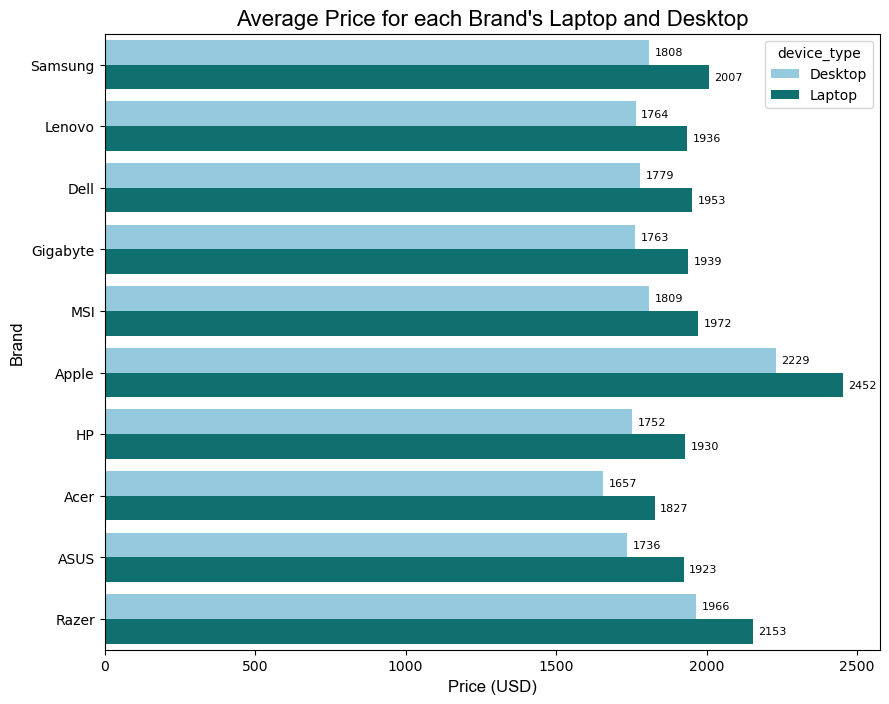
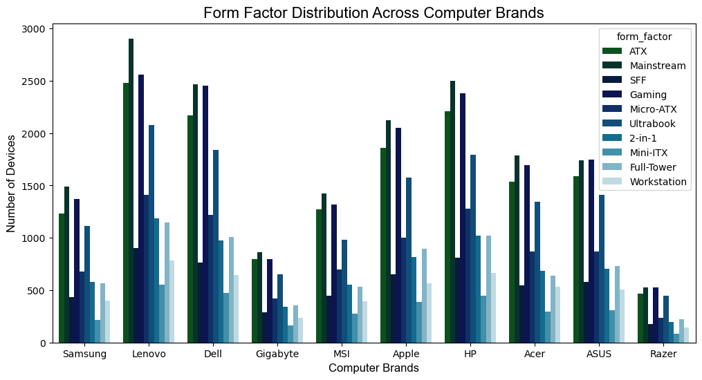
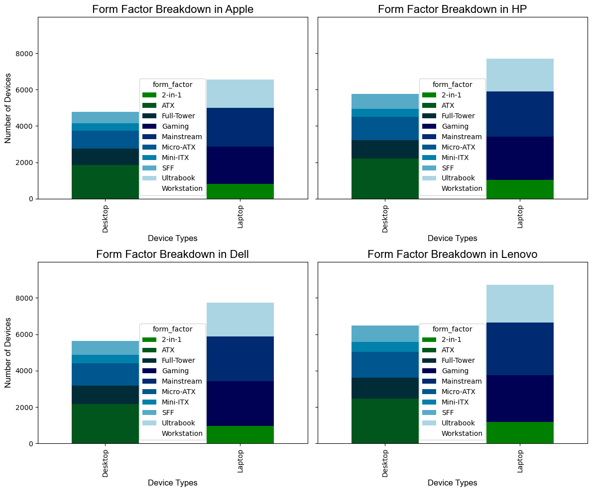
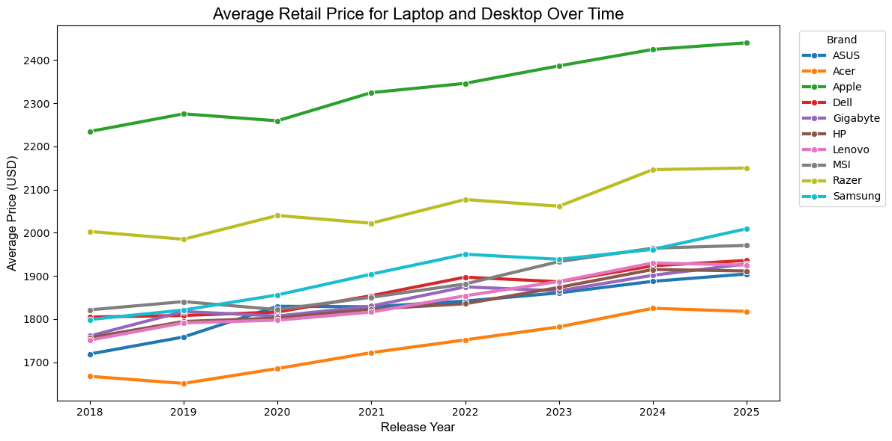
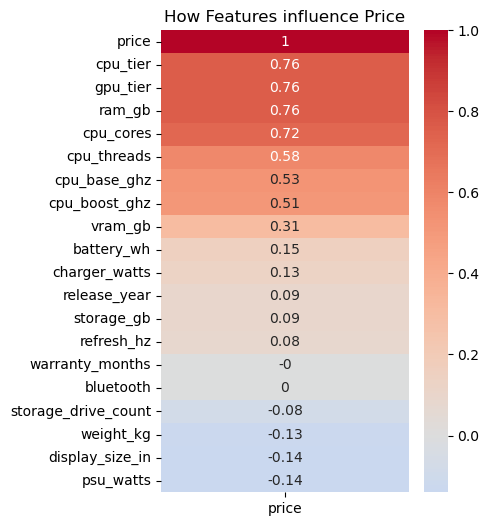
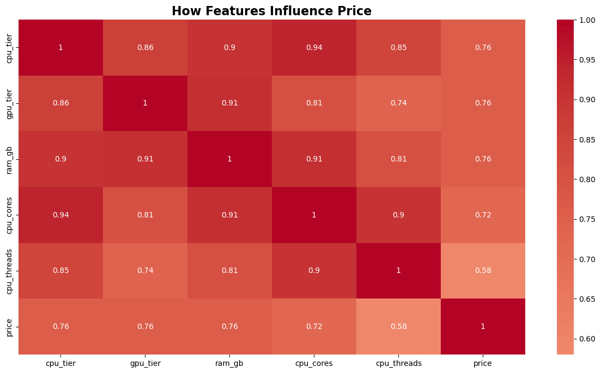
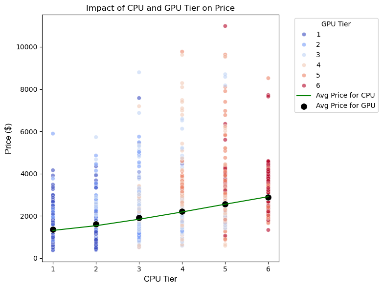
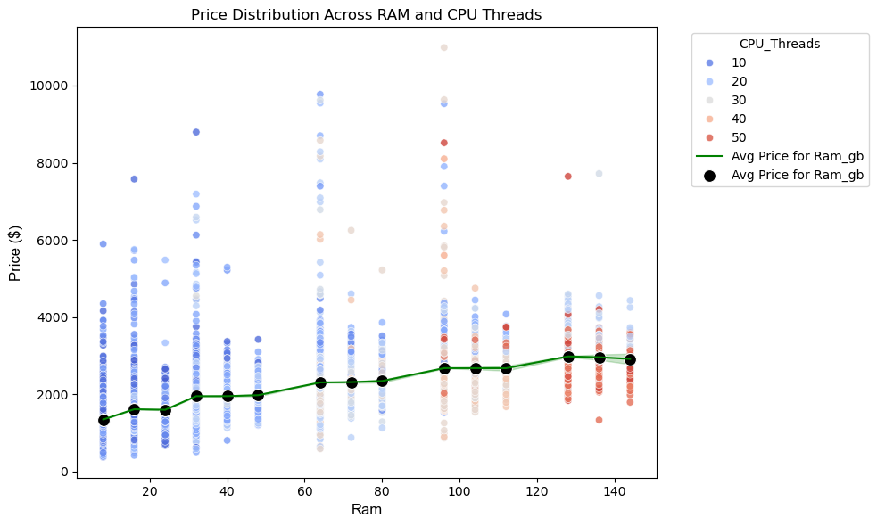
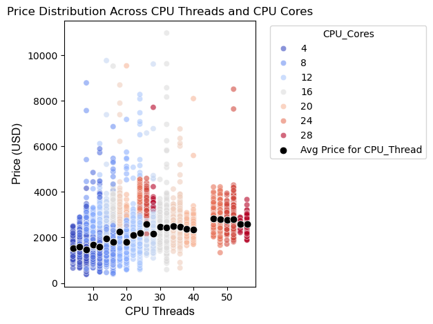

# Analyzing Computer Prices Overtime

## Table of Contents
- [Overview](#Overview)
- [Methodology](#Methodology)
- [Dataset](#Dataset)

## Overview
Research Questions:
- "Has the price for a computer significantly increase overtime?​
- "What is your recommendation on what laptop/desktop to buy?" 

Direction: Analytical to answer what brand and its's device (computer and/or laptop) meets your need.

Dataset Shape (Rows, Columns): 100_000, 33 =  3_300_000

Categorical Fields/Qualitative – 15 Total -Non-numerical attributes or ranked tiers; describe what the computer is. Device Attributes 

    Device Identify: device_type, brand, model, os, form_factor
    CPU: cpu_brand, cpu_model, cpu_tier,
    GPU: gpu_brand, gpu_model, gpu_tier,
    storage_type, display_type,
    Connectivity: wifi, bluetooth

Quantitative - 18 Total -Numeric measurements; describe how much/powerful/expensive the computer is. To sum it up, quantitative fields hold the Technical Benchmark/Performance data.

    Details (Retail info): release_year, weight_kg, price, warranty_months,
    CPU Specs: cpu_cores, cpu_threads, cpu_base_ghz, cpu_boost_ghz,
    Storage: vram_gb, ram_gb, storage_gb, storage_drive_count,
    Laptop Display: display_size_in, resolution, refresh_hz,
    PSU & Charger/PSU: battery_wh, charger_watts, psu_watts

## Methodology 

### Exploratory Data Analysis (EDA) 

- Describe().T ​

(Break)

- Boolean Filtering 

### Pandas Aggregate
- mean -> Average Pricing
- values_count -> Total Quantity

### Data Visualization 

- Double/Multi Bar Plot

(BreaK)

(BreaK)

- Stacked Bar Plot

(Break)

- Line Plot

(Break)

(Break)

- Heatmap

(break)

(break)

- Stacked Scatterplots 

(break)

(break)

(break)

## Acknodwlegement

I want to give credit to paperxd since I have used his dataset for my analaysis and already
cleaned up and organized as well. 
Provided below is the Kaggle Dataset used for this project:
    https://www.kaggle.com/datasets/paperxd/all-computer-prices/data​
